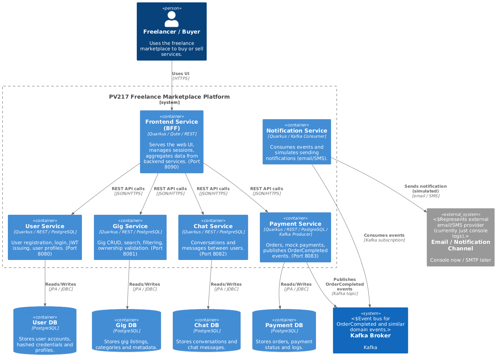

# PV217 — Freelance Marketplace (Event-Driven Microservices)

**Live Demo:** https://primegigsbrno.live  
**Status:** MVP Completed — Live Deployment (Quarkus, Kafka, Docker)

---

## 0. Project Overview

This project is a microservices-based freelance marketplace platform where clients can hire service providers.  
It is built as a Backend-for-Frontend (BFF) architecture using **Quarkus** and **Event-Driven design**.

**Typical User Flow:**
1. A new user registers through the frontend → **User Service** handles identity.
2. The user creates a gig → **Gig Service** validates ownership & authorization.
3. A buyer clicks "Pay Now" → **Payment Service** updates order and publishes a Kafka event.
4. **Notification Service** consumes the event and simulates sending a confirmation email.

---

## 1. Architecture & Domain Design

The system is organized as a **microservices monorepo**, deployed via Docker Compose.  
Services follow **Domain-Driven Design (DDD)** and are structured as independent **Bounded Contexts**.

### Why Microservices?
**Pros:**
- Isolation (e.g., Chat Service failure doesn’t affect User Service),
- Independent scalability,
- Clear separation of concerns.

**Cons:**
- More operational complexity,
- Higher initial resource usage.

---

## 2. Microservices (Bounded Contexts)

### 2.1 👤 User Service — Identity Context
- **Responsibilities:** Authentication, JWT issuance, password hashing (bcrypt), profile management.
- **Data Ownership:** Authoritative source for user identities.

**Key Endpoints:**
- `POST /api/users/register`
- `POST /api/users/login`
- `GET /api/users/profile`
- `PUT /api/users/profile`
- `GET /api/users/{id}`

---

### 2.2 💼 Gig Service — Catalog Context
- **Responsibilities:** Gig management, search, filtering, ownership validation.
- **Data Ownership:** Authoritative source for gig details.

**Key Endpoints:**
- `POST /api/gigs`
- `GET /api/gigs`
- `GET /api/gigs/my`
- `DELETE /api/gigs/{id}`

---

### 2.3 💬 Chat Service — Communication Context
- **Responsibilities:** Persistent messaging between users, conversations, history.
- **Data Ownership:** Authoritative source for chat messages.

**Key Endpoints:**
- `POST /api/chat`
- `GET /api/chat/{otherUserId}`
- `GET /api/chat/conversations`

---

### 2.4 💳 Payment Service — Billing Context
- **Responsibilities:** Mock payment processing, order lifecycle management, event publication to Kafka.
- **Data Ownership:** Authoritative source for orders.

**Key Endpoints:**
- `POST /api/payment/orders`
- `PUT /api/payment/orders/{id}/pay`
- `DELETE /api/payment/orders/{id}`

---

### 2.5 🔔 Notification Service — Event Consumer
- **Responsibilities:** Background worker consuming Kafka events, simulating email/SMS.
- **Endpoints:** None (asynchronous worker).

---

---
## 3. Event-Driven / Reactive Showcase

**Flow:**
1. Payment Service publishes `"OrderCompleted"` event to **Kafka**.
2. Notification Service consumes the event asynchronously.
3. The system acknowledges payment instantly while notifications run in the background.

This demonstrates:
- Loose coupling,
- High resilience,
- Eventual consistency,
- Reactive, message-driven architecture.

---

## 4. Running the Project (Deployment Guide)

### **Prerequisites**
- Java 17+
- Docker
- Docker Compose v2+

### **Steps**
```bash
git clone <repo-url>
cd <repo>
mvn package -DskipTests       # builds all services
docker compose up -d --build  # runs the entire system
